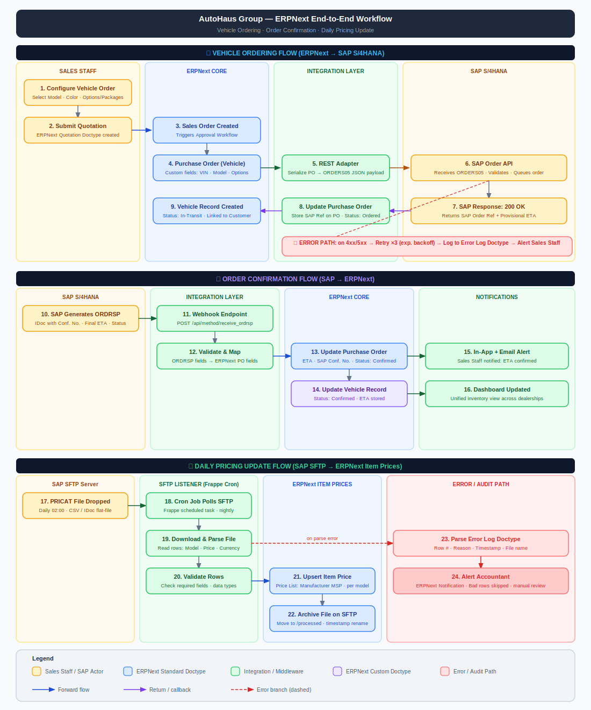

# ERPNext System Design — AutoHaus Group

**Version:** v15 (self-hosted, on-premise)  
**Date:** March 2026

---

---

# Part 1: Data Model Design

## Standard Doctypes (May Be Required)

| Doctype | Purpose |
|-------|-------|
| Company | Single record for the legal entity covering both dealerships |
| Warehouse | One or multiple per dealership for physical stock separation |
| Cost Center | One per dealership for P&L reporting |
| Vehicle (or Asset) | Primary vehicle master (Asset if maintenance required) |
| Customer | Buyer management |
| Supplier | Manufacturer |
| Purchase Order | Raised per vehicle order toward the manufacturer |
| Purchase Receipt | Raised when vehicle arrives at dealership |
| Sales Order / Sales Invoice | Raised when customer commits to a vehicle |

---

## Note on Vehicle vs Item

The **Vehicle Doctype** will be customized with custom fields similar to the required master.

Each **Vehicle record represents one physical vehicle**.

- **Items and Serial Numbers** will be used for **parts and accessories**.

---

## Custom Doctypes

### Vehicle Master
Sales staff select:

- Model  
- Color  
- Options / Packages  

### Purchase Order

Tracks one order list with SAP:

- Order Status *(Pending / Transmitted / Confirmed)*  
- SAP Order Reference  

### Trade-in Vehicle

To be discussed.

---

## Entity Relationships

---

## Two-Dealership Setup

Both dealerships share **one Company**.

Separation is achieved through:

- **Warehouses** → Stock separation  
- **Cost Centers** → Financial reporting  

### User Permissions

Sales staff are restricted to their dealership through the **Warehouse field**.

- Sales staff → Access only their warehouse  
- Accountant / Management → Access both warehouses  

A **unified inventory view** is available using standard stock reports filtered by:

- Warehouse  
- Company  

---

# Part 2: Integration Architecture

## Architecture

No separate middleware server is required.

All integration logic lives within the **ERPNext Custom App** using:

- Frappe background jobs  
- Whitelisted API endpoints  

---

## Method Choice

**REST API**

Reasons:

- Real-time communication with SAP  
- Instant notification to **Sales Staff / Purchase Staff**  
- Simpler architecture than RFC integration  

---

## Data Flows

### Order Flow (ERPNext → SAP)

1. Sales staff submit **Vehicle Configuration**  
2. **Manufacturer Order** created with status **Pending**  
3. Frappe scheduler runs every **5 minutes**  
4. Order sent to **SAP via REST API**  
5. On success:
   - Status updated to **Pending Confirmation**
   - **SAP reference stored**

---

### Confirmation Flow (SAP → ERPNext)

1. Order confirmed in **SAP**  
2. SAP sends confirmation via **REST API**  
3. Order status updated to **Confirmed**  
4. **Sales person receives notification**

---

## Error Handling

| Error Code | Response |
|-----------|----------|
| Error 402 | SAP REST timeout — retry through background job |

---

# Part 3: Assumptions & Open Questions

## Assumptions

- Single legal entity → **One ERPNext Company**
- No inter-company transactions required
- Vehicle catalogue *(models, colours, option codes)* is stable enough to maintain manually
- Updated when **new model years** are released
- Manufacturer **REST API documentation** and **sandbox environment** are available
- **Single local currency** used throughout the process
- A **dedicated decision maker** is available on behalf of AutoHaus
- Training model: **Train-the-Trainer**
- Training provided to **one ERP Champion**

---

## Questions for the Customer

- When should the order be placed with the manufacturer: before receiving the customer order or after?**
- Expected **number of transactions per day**
- **Number of users** requiring training
- **Budget** planned for full implementation and training
- **Timeline / deadline** for implementation
- **Post Go-Live support** requirements

---

## Out of Scope

The following areas are **not included in the current implementation scope**:

- Workshop / Service module
- CRM / Lead pipeline
- SAP RFC integration channel *(REST API used instead)*
- HR & Payroll
- Multi-currency support *(single currency assumed)*

---

# End of Document

